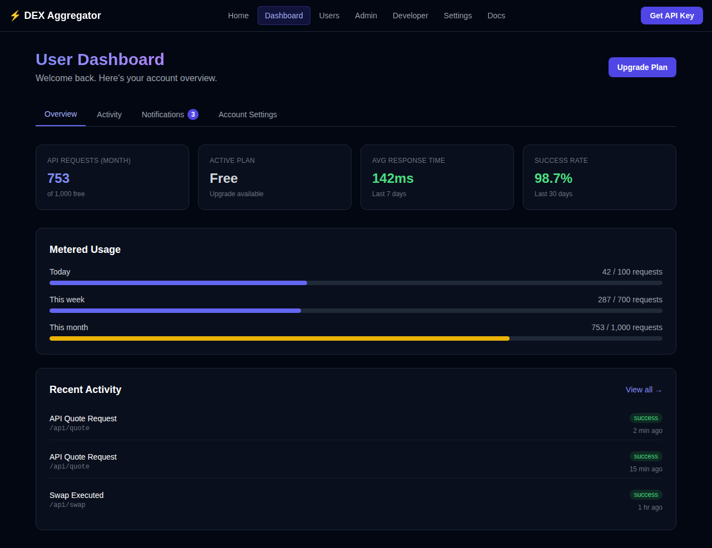
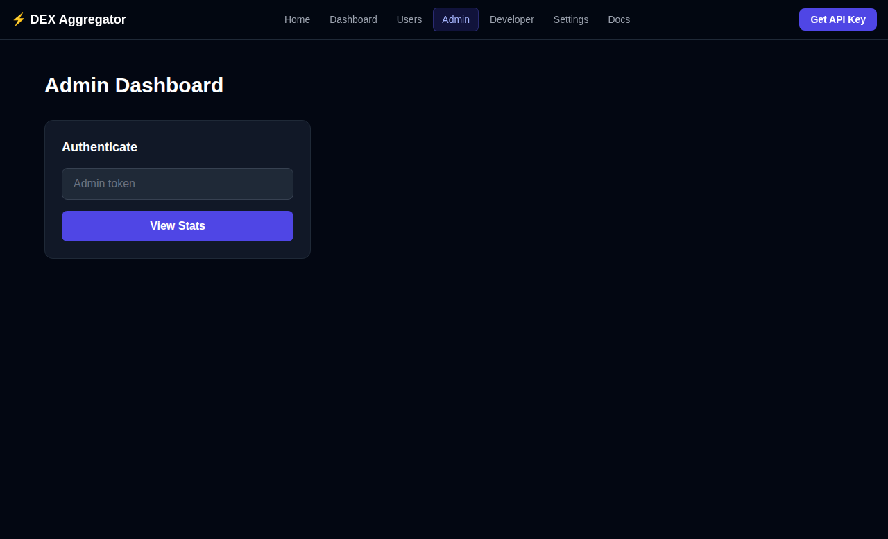
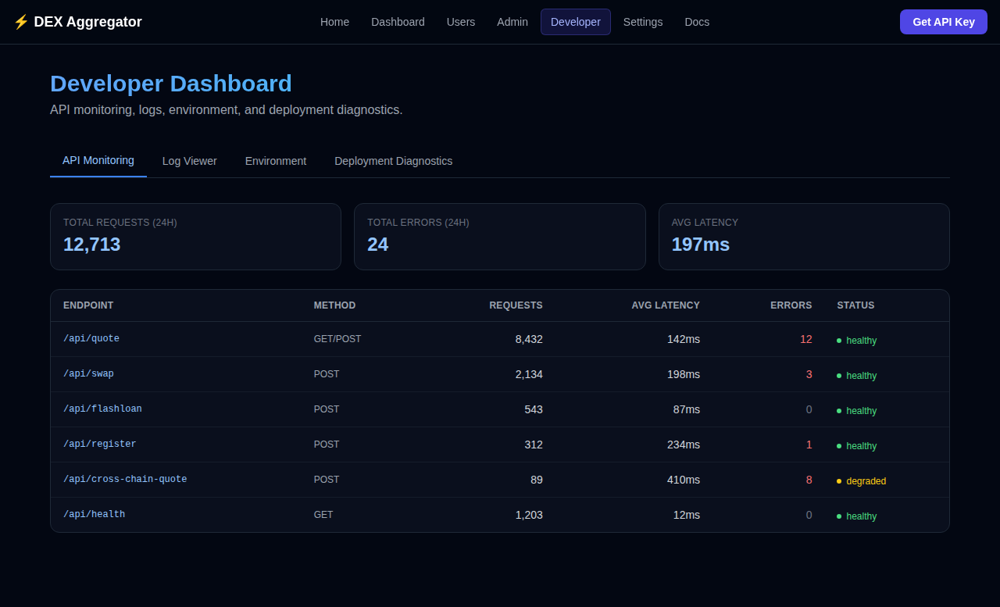

# Meta DEX Aggregator


[](./LICENSE)

An open-source meta aggregator library that provides all the benefits of DEX aggregation in a developer-friendly package — without any middlemen.

## Features

- **Better Prices** — Indexes liquidity from multiple DEXes (1inch, 0x Protocol, Paraswap, Uniswap) to find the best swap rates.
- **Reduced Slippage** — Splits trades across multiple DEXes to minimize price impact.
- **Atomic Swaps** — Supports complex multi-hop routes for tokens without direct liquidity pools.
- **Flash Loan Aggregator** — Compare flash loan providers (Aave V3, dYdX, Uniswap V3, Balancer) to find the lowest fee. Borrow, execute, and repay atomically in a single transaction.
- **Open Source** — Fully open source; inspect, modify, and contribute freely.
- **No Middlemen** — Interacts directly with DEX aggregators, eliminating centralized intermediaries.
- **Onchain Simulation** — Simulate swaps onchain before executing to verify accuracy, gas costs, and potential reverts.
- **Developer API** — Free-tier API with registration; Pro and Enterprise plans available.
- **Enterprise Dashboards** — User, Admin, and Developer dashboards with real-time metrics.
- **Security Hardened** — Edge middleware enforcing security headers and rate limiting.

## UI Preview

### User Dashboard



### Admin Dashboard



### Developer Dashboard




## Quick Start

### Prerequisites

- Node.js 18+
- npm or yarn

### Installation

```bash
git clone https://github.com/<your-org-or-username>/aggregator.git
cd aggregator
npm install
```

### Development

```bash
npm run dev
```

Open [http://localhost:3000](http://localhost:3000) to view the app.

### Build

```bash
npm run build
npm start
```

## API Reference

### Get Best Quote

```http
GET /api/quote?fromToken=0xEeee...&toToken=0xA0b8...&amount=1000000000000000000&chainId=1
```

```http
POST /api/quote
Content-Type: application/json

{
  "fromToken": "0xEeeeeEeeeEeEeeEeEeEeeEEEeeeeEeeeeeeeEEeE",
  "toToken": "0xA0b86991c6218b36c1d19D4a2e9Eb0cE3606eB48",
  "amount": "1000000000000000000",
  "chainId": 1,
  "slippage": 0.5
}
```

Response includes the best quote across all aggregators, savings compared to worst quote, and all individual quotes.

### Execute Swap

```http
POST /api/swap
Content-Type: application/json

{
  "fromToken": "0xEeeeeEeeeEeEeeEeEeEeeEEEeeeeEeeeeeeeEEeE",
  "toToken": "0xA0b86991c6218b36c1d19D4a2e9Eb0cE3606eB48",
  "amount": "1000000000000000000",
  "chainId": 1,
  "fromAddress": "0xYourWalletAddress"
}
```

### Flash Loan Quotes

```http
GET /api/flashloan?asset=0xA0b8...&amount=1000000000000&chainId=1&targetContract=0xYours
```

```http
POST /api/flashloan
Content-Type: application/json

{
  "asset": "0xA0b86991c6218b36c1d19D4a2e9Eb0cE3606eB48",
  "amount": "1000000000000",
  "chainId": 1,
  "targetContract": "0xYourContract",
  "params": "0x"
}
```

### Developer Registration

```http
POST /api/register
Content-Type: application/json

{
  "name": "Alice",
  "email": "alice@example.com",
  "projectName": "My DeFi App",
  "useCase": "Yield optimization"
}
```

Returns an API key for the free tier (1,000 requests/month).

## Library Usage

```typescript
import { getQuotes, getFlashLoanQuotes } from "@/lib";

// Get best swap quote across all aggregators
const bestQuote = await getQuotes({
  fromToken: "0xEeeeeEeeeEeEeeEeEeEeeEEEeeeeEeeeeeeeEEeE",
  toToken: "0xA0b86991c6218b36c1d19D4a2e9Eb0cE3606eB48",
  amount: "1000000000000000000",
  chainId: 1,
  slippage: 0.5,
});

console.log(`Best price from: ${bestQuote.aggregator}`);
console.log(`Output: ${bestQuote.toAmount}`);
console.log(`Savings vs worst: ${bestQuote.savingsPercent.toFixed(2)}%`);

// Get best flash loan provider
const flashLoan = await getFlashLoanQuotes({
  asset: "0xA0b86991c6218b36c1d19D4a2e9Eb0cE3606eB48",
  amount: "1000000000000",
  chainId: 1,
  targetContract: "0xYourContract",
  params: "0x",
});

console.log(`Best flash loan from: ${flashLoan.best.provider}`);
console.log(`Fee: ${flashLoan.best.feePercent}%`);
```

## Supported Chains

| Chain | ID |
|-------|----|
| Ethereum | 1 |
| Optimism | 10 |
| BNB Smart Chain | 56 |
| Polygon | 137 |
| Base | 8453 |
| Arbitrum One | 42161 |
| Avalanche | 43114 |

## Supported Aggregators

| Aggregator | Type |
|------------|------|
| 1inch | DEX Aggregator |
| 0x Protocol | DEX Aggregator |
| Paraswap | DEX Aggregator |
| Uniswap | DEX |

## Flash Loan Providers

| Provider | Fee | Chains |
|----------|-----|--------|
| Aave V3 | 0.05% | ETH, OP, MATIC, ARB, AVAX, Base |
| dYdX | 0.00% | ETH |
| Uniswap V3 | 0.05% | ETH, OP, MATIC, ARB, Base |
| Balancer | 0.00% | ETH, MATIC, ARB |

## Deployment

Deploy to Vercel with a single click:

[](https://vercel.com/new)

Or use the included `vercel.json` configuration for manual deployment.

Set the `ADMIN_TOKEN` environment variable for admin dashboard access.

## Pages

| Route | Description |
|-------|-------------|
| `/` | Landing page with feature overview and live demo |
| `/dashboard` | User dashboard — overview, activity, notifications, account settings |
| `/users` | Registered users with role/plan filters |
| `/admin` | Admin dashboard — stats, top pairs, recent registrations (requires admin token) |
| `/developer` | Developer dashboard — API monitoring, logs, environment, deployment diagnostics |
| `/settings` | User settings — profile, API key management, notifications |
| `/docs` | Full API and SDK documentation |
| `/register` | Developer registration and API key generation |

## Documentation

- [Architecture](docs/ARCHITECTURE.md) — system design, module map
- [Deployment](docs/DEPLOYMENT.md) — Vercel, self-hosted, local dev
- [Environment Variables](docs/ENVIRONMENT.md) — complete reference
- [User Guide](docs/USER_GUIDE.md) — registration, API usage, dashboard
- [Admin Guide](docs/ADMIN_GUIDE.md) — admin auth, stats API, RBAC roles
- [Developer Guide](docs/DEVELOPER_GUIDE.md) — SDK, API reference, testing

## Changelog

See [CHANGELOG.md](./CHANGELOG.md) for full release history.

## License

MIT
